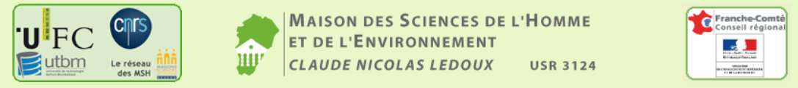

GeoSync was originally created in 2015 by Alexandre Maindron and Martin Tovmassian.

    Alexandre MAINDRON <alexandre@exmackina.com>
    Martin TOVMASSIAN <martin.tovmassian@gmail.com>

The code is currently written and maintened by Sophie Mollard.

    MOLLARD Sophie <sophie.mollard.2707@gmail.com>

The project manager is Ernest Chiarello.

    Ernest CHIARELLO <ernest.chiarello@univ-fcomte.fr>

The project is funded by the MSHE-Besançon.

